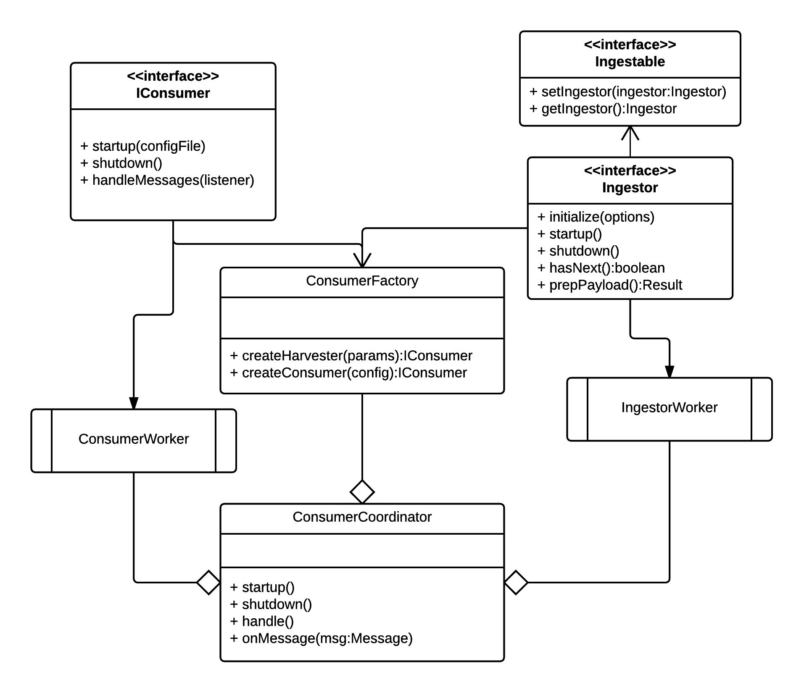
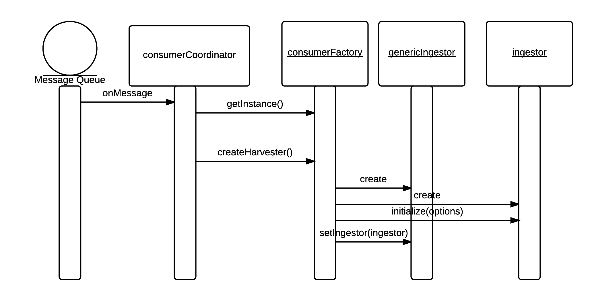

Developer Guide
---------------

The system consists of a dispatcher , one or more consumer heads running on separate machines and a manager command line interface to send messages to interactively start ingestion and processing pipeline for a source.

## Dispatcher
The dispatcher is preconfigured with one or more pipeline definitions to harvest/ingest documents for a source, process/enhance/transform them for indexing. The dispatcher listens to the op-log capped collection of MongoDB 
for database update events and based on the preconfigured pipeline definitions creates and sends messages 
to their corresponding message queues. The messages are consumed by consumers coordinated by one or more 
consumer heads. Each step in a pipeline is handled by a specific consumer. When a consumer finishes 
the processing of a document it sets the document status to a preconfigured value indicative of the next step in the pipeline and saves the document back to the MongoDB. This creates an op-log activity, which triggers 
the dispatcher. If the pipeline definition has a route from the current document status to a message queue, 
indicative of further pipeline processing another message is generated by the dispatcher and put to the message 
queue indicated by the route. This triggers the corresponding consumer on one of the consumer heads.
The persistent message queues deliver each message only once. Thus, if more than one consumer head is listening
on the same message queue, only one of them will process the document identified by the message as desired.


## Consumer Head

Consumer head coordinates a set of consumers. A consumer listens to a preconfigured message queue and 
applies a predefined operation to the document indicated by the received message and on success sets the 
processing status of the document to a preconfigured status. 
A class diagram showing the most important classes and interfaces for consumer head is shown below.
The main class of the consumer head is `org.neuinfo.foundry.consumers.coordinator.ConsumerCoordinator`
Each consumer implements `org.neuinfo.foundry.consumers.coordinator.IConsumer` interface.
Ingestors are specific type of consumers. Each ingestor implements the interface
`org.neuinfo.foundry.consumers.plugin.Ingestor`. At startup `ConsumerCoordinator` reads 
a consumer configuration file (`consumers-cfg.xml`) and using the  `ConsumerFactory` singleton 
creates the corresponding consumers. There is also a generic `JavaPluginConsumer` 
that abstracts away common functionality of consumers including message processing 
and uses a plugin mechanism for the specific functionality. Most of the current consumers are implemented 
as plugins to this generic consumer. A consumer plugin implements 
`org.neuinfo.foundry.consumers.plugin.IPlugin` interface. 
Each consumer runs in its own thread (`ConsumerWorker`). Consumers must be stateless.



All ingestors are implemented as plugins to the 
`org.neuinfo.foundry.consumers.jms.consumers.GenericIngestionConsumer` class. 
The currently available ingestor plugins are located in the 
`org.neuinfo.foundry.consumers.jms.consumers.ingestors` package.
The `Ingestor` interface has lifecycle methods to initialize parameters received in the message body
to start the ingestion process. This include the harvest url and ingestion type specific parameters 
defined in the harvest description JSON file stored in the MongoDB under `sources` collection.
The `startup()` method is generally used to get the data to an intermediate storage. 
An ingestor plugin acts like an iterator where `hasNext()` method returns true if there is still 
more records to process and `prepPayload()` method returns a JSON representation of 
the original record harvested. The `GenericIngestionConsumer` is responsible for duplicate checking, 
document wrapper generation.




# Implementing a new Enhancer

All enhancers need to implement the `org.neuinfo.foundry.consumers.plugin.IPlugin` interface which is located 
in the `consumer-plugin-api` subproject of the Foundry-ES. To develop a new enhancer, you need to include 
the Foundry-ES `common` and `consumer-plugin-api` libraries to your Maven `pom.xml` after you have built it 
via `mvn -Pdev clean install` in addition to all the dependencies from `common/pom.xml` of the Foundry-ES.

```xml
<dependency>
   <groupId>org.neuinfo</groupId>
   <artifactId>foundry-es-common</artifactId>
   <version>1.0-SNAPSHOT</version>
</dependency>
<dependency>
    <groupId>org.neuinfo</groupId>
    <artifactId>foundry-es-consumer-plugin-api</artifactId>
    <version>1.0-SNAPSHOT</version>
</dependency>

```

The `org.neuinfo.foundry.consumers.plugin.IPlugin` interface is shown below; 

```java
public interface IPlugin {

    public void initialize(Map<String, String> options) throws Exception;

    public Result handle(DBObject docWrapper);

    public String getPluginName();
}
```

The enhancement is done in the `handle(DBObject docWrapper)` method which takes a Mongo `DBObject` 
object corresponding to the currently processed [document wrapper](doc_ingestion.md) from the Mongo database. 
The original document is stored inline in the document wrapper. 
Below is a code fragment to get the original document converted to JSON from the `docWrapper`.

```java
BasicDBObject data = (BasicDBObject) docWrapper.get("Data");
DBObject originalDoc = (DBObject) docWrapper.get("OriginalDoc");
JSONObject json = JSONUtils.toJSON((BasicDBObject) originalDoc, false);

```

To convert a Mongo Java driver database object to JSON you can use the following snippet

```java
JSONObject json = JSONUtils.toJSON((BasicDBObject) originalDoc, false);
```

Similarly, a manipulated json object can be put to the document wrapper using Java code similar to the following

```java
DBObject data = (DBObject) docWrapper.get("Data");
DBObject spatial = JSONUtils.encode(spatialJson, false);
data.put("spatial", spatial);
```

The `handle` method returns its result using the following Java code snippet

```java
return new Result(docWrapper, Result.Status.OK_WITH_CHANGE);
```

If there is an error occurred during the enhancement you need to return an error result as shown below;

```java
Result r = new Result(docWrapper, Result.Status.ERROR);
r.setErrMessage(errorMessage);
return r;
```

To get more information about writing new enhancers, please check to code of the existing enhancers under the 
package `org.neuinfo.foundry.consumers.jms.consumers.plugins` namely 
`KeywordEnhancer`, `SpatialEnhancer`, `OrganizationEnhancer` and `WAFExporter`.


